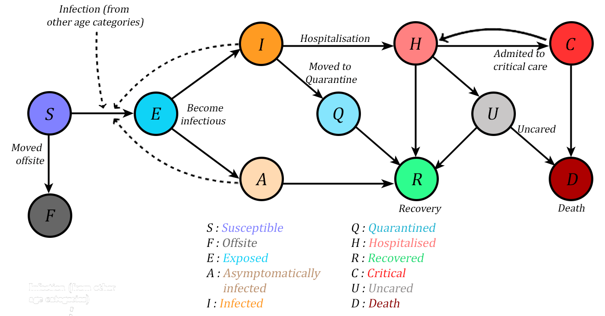

Deterministic Compartmental Model
=================================

Summary
=======
This documentation elaborates on the compartmental model used by the `Crisis Modelling team <https://www.aiforgoodsimulator.com/>`_ to forcast the spread of the COVID'19 disease. We will first understand to mathematically model the pandemic using ordinary differential equations and then use python to simulate the model.  Later we visualize the effects of the spread like the one in the figure below.

Compartmental Model
==========
Within epidemiology, a compartment model is a type of mathematical model that basically segments a population into discrete compartments (states) and models the interactions between the segments. Our model comprises of 11 disease state compartments and 8 age compartments with a 10 years gap, starting from 0-10 to 70 and above.

  Model Diagram.
  
The states used in the model are as follows:

- Susceptible: People in this compartment are what are called 'naive' - and are neither exposed or infected. (Think about everyone prior to COVID-19's arrival. 🙂) So essentially, this is the population before COVID-19 (or another disease) comes in. - People here can move either into the Exposed or the Offsite categories.
- Offsite: People in this compartment has been moved away from the camp prior to COVID-19 exposure, and is not in the population 'eligible' to get exposed to COVID-19.
- Exposed: People in this compartment have been exposed to COVID-19, but are not infected yet. People who are Exposed can either move into the Infected or Asymptomatically Infected compartments.
- Infected: People in this compartment have been exposed to, and infected with, COVID-19. At this stage, the individual would be showing symptoms, and is capable of transmitting COVID-19 to other individuals. The person can either go into the Recovered or Hospitalised compartments.
- Asymptomatically infected: People in this compartment have been exposed to, and infected with, COVID-19, *but are not showing symptoms*. Someone in this compartment is capable of transmitting COVID-19 to other individuals. A person in this compartment would go into the Recovered compartment.
- Hospitalised: If an infected individual is sick with COVID-19, they can become moderately ill and require hospitalisation. A person in this compartment would either go into the Critical Care compartment, or into the Recovered compartment.
- Critical Care: If an individual becomes morbidly ill with COVID-19 (i.e., very close to death) while hospitalised, they will move into the Critical Care compartment. A person in this compartment either moves back to the Hospitalised compartment (i.e., they are getting 'better'), or move into the Dead compartment.
- Recovered: Someone in this compartment, has been infected with COVID-19, and has recovered completely from the illness. They are not necessarily capable of transmitting COVID-19 to others.
- Death: Individuals in this compartment have perished due to COVID-19 in this case - and have been hospitalised and in critical care. No information is known about other co-morbidities of this individual. They are taken out of the model and cannot move around to any of the other compartments.

Define the ODEs
==========
The ordinary differential equations(ODEs) for the compartmental model are defined as follows:

.. code-block:: python

    S_vec=y2d[Config.compartment_index["S"],:]      
    # (-scenario_dict["transmission_reduction_factor"]* beta* S_vec* infection_total- offsite)
    E_vec = y2d[Config.compartment_index["E"],:]
    # (-scenario_dict["transmission_reduction_factor"]* beta* S_vec* infection_total- E_latent)
    I_vec = y2d[Config.compartment_index["I"], :]
    # (self.p_symptomatic*E_latent-I_removed- quarantine_sicks+quarantined_sicks_sendback)
    H_vec = y2d[Config.compartment_index["H"], :]
    #  (self.p_hosp_given_symptomatic * I_removed- hosp_rate * H_vec+ death_rate_ICU*(1-self.death_prob_with_ICU) * np.minimum(C_vec, hospitalized_on_icu)+self.p_hosp_given_symptomatic * Q_quarantined)
    A_vec = y2d[Config.compartment_index["A"], :]
    # (1 - self.p_symptomatic) * E_latent - A_removed)
    C_vec = y2d[Config.compartment_index["C"], :]
    # (icu_cared - deaths_on_icu)
    Q_vec = y2d[Config.compartment_index["Q"], :]
    # (quarantine_sicks - Q_quarantined - quarantined_sicks_sendback)
    dydt2d[Config.compartment_index["D"], :] = (deaths_without_icu+ self.death_prob_with_ICU* deaths_on_icu)
    dydt2d[Config.compartment_index["O"], :] = offsite

Simulating the model
==========
...

Visualization
==========
...

Conclusion
==========
...

References
==========
...

Disclaimer
==========

The models are still underdevelopment and the official 1.0 release will mark the thorough testing of the model for portable use.

.. toctree::
   :maxdepth: 2

   covid19models/deterministic_compartmental_model

Indices and tables
==================

* :ref:`genindex`
* :ref:`modindex`
* :ref:`search`

